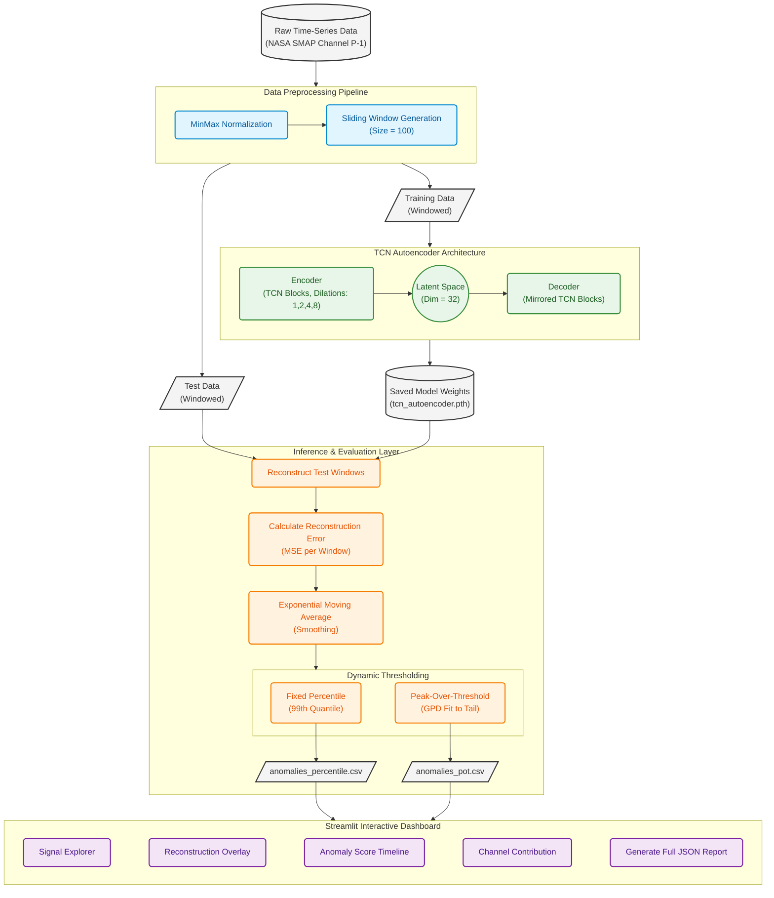

# Time-Series Anomaly Detector — TCN Autoencoder

An unsupervised anomaly detection system for multivariate time-series data,
built on a Temporal Convolutional Network (TCN) Autoencoder and deployed
as an interactive Streamlit dashboard. The system learns a compressed
representation of nominal sensor behavior and identifies deviations by
measuring reconstruction error at inference time.

---

## Architecture

The system is organized into four sequential stages that flow from raw data
to an interactive visualization layer.



---

## Project Structure

| Path                        | Purpose                                                   |
|-----------------------------|-----------------------------------------------------------|
| docker-compose.yml          | Service orchestration for the Streamlit application       |
| Dockerfile                  | Container build definition                                |
| .env.example                | All configurable environment variables with defaults      |
| submission.json             | Fixed hyperparameter record for reproducibility           |
| scripts/preprocess_data.py  | Download, normalize, and window the NASA SMAP dataset     |
| scripts/train.py            | Build and train the TCN Autoencoder                       |
| scripts/evaluate.py         | Generate anomaly scores and detected anomaly CSV files    |
| app/main.py                 | Streamlit interactive dashboard                           |
| models/                     | Trained model weights and training metadata               |
| data/processed/             | Normalized windows and scaler artifact                    |
| results/                    | Anomaly scores, detected anomalies, report JSON           |
| docs/TCN_vs_LSTM.md         | Architectural justification for TCN over LSTM             |
| tests/                      | Unit tests for preprocessing, model, and evaluation logic |

---

## Prerequisites

- Docker >= 24.0 and Docker Compose >= 2.20
- Or, for local execution: Python 3.11, pip

No credentials are required. The preprocessing script generates a seeded synthetic dataset that preserves
the structural properties of the SMAP channel with a known injected anomaly.
All generated files are cached in `data/raw/` so subsequent runs
do not repeat the generation.

---

## Running with Docker (Recommended)

The entire pipeline — preprocessing, training, evaluation, and dashboard launch —
executes automatically inside the container.

```bash
cp .env.example .env
docker-compose up --build
```

The Streamlit dashboard will be available at http://localhost:8501 once the
container reports healthy. The first run will take 10-15 minutes because
it generates the dataset, trains the model, and evaluates before starting
the UI.

To rebuild after a code change:

```bash
docker-compose down
docker-compose up --build
```

---

## Running Locally

```bash
python -m venv venv
source venv/bin/activate
pip install -r requirements.txt

python scripts/preprocess_data.py
python scripts/train.py
python scripts/evaluate.py
streamlit run app/main.py
```

Each script is independently runnable and validates that its dependencies
exist before executing.

---

## Script Reference

| Script                      | Command                                | Output                                                  |
|-----------------------------|----------------------------------------|---------------------------------------------------------|
| preprocess_data.py          | python scripts/preprocess_data.py      | data/processed/train.npy, test.npy, scaler.pkl          |
| train.py                    | python scripts/train.py                | models/tcn_autoencoder.pth, training_metadata.json      |
| evaluate.py                 | python scripts/evaluate.py             | results/anomaly_scores.csv, anomalies_*.csv             |

---

## Configuration

All hyperparameters and paths are controlled through environment variables.
Copy `.env.example` to `.env` and modify as needed.

| Variable              | Default         | Description                                              |
|-----------------------|-----------------|----------------------------------------------------------|
| STREAMLIT_SERVER_PORT | 8501            | Port the Streamlit server listens on                     |
| DATASET_CHANNEL       | P-1             | NASA SMAP channel identifier                             |
| WINDOW_SIZE           | 100             | Sliding window length in timesteps                       |
| LATENT_DIM            | 32              | Bottleneck dimension of the autoencoder                  |
| TCN_LAYERS            | 4               | Number of TCN residual blocks in encoder and decoder     |
| TCN_KERNEL_SIZE       | 3               | Convolutional kernel size                                |
| TCN_CHANNELS          | 64              | Hidden channel count for intermediate layers             |
| EPOCHS                | 50              | Training epoch count                                     |
| LEARNING_RATE         | 0.001           | Initial Adam optimizer learning rate                     |
| PERCENTILE_QUANTILE   | 0.99            | Quantile for fixed-percentile threshold                  |
| POT_INITIAL_QUANTILE  | 0.95            | Initial tail cutoff for Peak-Over-Threshold fitting      |

---

## Dashboard Panels

The Streamlit interface provides four analysis panels accessible from a single page.

**Signal Explorer** allows selection of any subset of input channels via a multiselect
control. The selected channels are rendered as an overlaid time-series chart, enabling
direct visual comparison of how different sensors behave during a given time window.

**Reconstruction Overlay** shows the original normalized signal alongside the model's
reconstruction for a single selected channel. The gap between the two lines is the
reconstruction error. Wide gaps at specific timesteps visually confirm what the
numerical anomaly scores reflect.

**Anomaly Score Timeline** plots the smoothed reconstruction error as a continuous
signal. A threshold line is controlled by a slider, and anomaly points above the
threshold are marked in red. Moving the slider dynamically updates the set of
detected anomalies and the count metric displayed below the chart.

**Channel Contribution** appears when an anomaly event is selected. It renders a bar
chart of per-channel MSE at the selected window, identifying which sensor channels
contributed most to the elevated reconstruction error. This is the root cause analysis
view intended for operational investigation.

---

## Thresholding Methods

**Percentile** sets the threshold as the 99th percentile of smoothed reconstruction
errors across all test windows. It is stationary and simple, making it the baseline
method for comparison.

**Peak-Over-Threshold** applies Extreme Value Theory by fitting a Generalized Pareto
Distribution to errors that exceed the 95th percentile. The final threshold is derived
from the fitted distribution at a target exceedance probability of 0.0001, making it
statistically adaptive to the shape of the tail rather than dependent on a single
arbitrary quantile.

---

## Generating a Report

Click the **Generate Full Report** button in the dashboard to serialize the current
visualization state to `results/streamlit_report.json`. The file contains four
top-level keys: `signalData`, `reconstructionData`, `anomalyScores`, and
`channelContributions`, suitable for downstream programmatic analysis or reporting.

---

## Running Tests

```bash
pip install pytest
pytest tests/ -v
```

Tests cover window creation edge cases, causal convolution correctness, autoencoder
output shapes, and thresholding logic.

---

## Docker Hub

To push the built image to Docker Hub:

```bash
docker tag tcn_anomaly_detector rushi5706/tcn-anomaly-detector:latest
docker push rushi5706/tcn-anomaly-detector:latest
```
